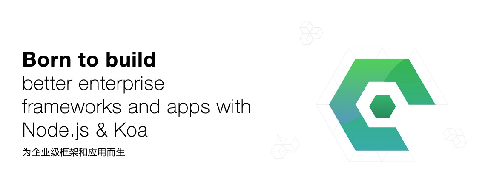

English | [简体中文](./README.zh-CN.md)

<div style="text-align:center">
	
</div>

[](https://npmjs.org/package/egg)
[](http://packagequality.com/#?package=egg)
[](https://npmjs.org/package/egg)
[](https://nodejs.org/en/download/)
[](https://app.fossa.com/projects/git%2Bgithub.com%2Feggjs%2Fegg?ref=badge_shield)

[](https://github.com/eggjs/egg/actions?query=branch%3Amaster)
[](https://codecov.io/gh/eggjs/egg)
[](https://snyk.io/test/npm/egg)
[](https://opencollective.com/eggjs)

## Features

- Built-in Process Management
- Plugin System
- Framework Customization
- Lots of [plugins](https://github.com/search?q=topic%3Aegg-plugin&type=Repositories)

## Quickstart

Follow the commands listed below.

```bash
$ mkdir showcase && cd showcase
$ pnpm create egg@beta
$ pnpm install
$ pnpm run dev
$ open http://localhost:7001
```

> Node.js >= 20.19.0 required, [supports `require(esm)` by default](https://nodejs.org/en/blog/release/v20.19.0).

## Monorepo Structure

This project is structured as a pnpm monorepo with the following packages:

- `packages/egg` - Main Eggjs framework
- `examples/helloworld-commonjs` - CommonJS example application
- `examples/helloworld-typescript` - TypeScript example application
- `site` - Documentation website

The monorepo uses **pnpm catalog mode** for centralized dependency management, ensuring consistent versions across all packages.

### Development Commands

```bash
# Install dependencies for all packages
pnpm install

# Build all packages
pnpm run build

# Test all packages
pnpm run test

# Run specific package commands
pnpm --filter=egg run test
pnpm --filter=@examples/helloworld-typescript run dev
pnpm --filter=site run dev
```

### Local External Services

Some DAL, ORM, Redis, and ecosystem benchmark paths need local MySQL and Redis services. Start the repository-aligned Docker services before running those tests on a clean machine:

```bash
pnpm run dev:services:start
```

This starts MySQL 8 and Redis 7, matching the main CI service versions, and creates the databases used by local DAL/ORM/e2e fixtures: `test`, `apple`, `banana`, `test_runtime_datasource`, `test_runtime_dao`, `test_dal_plugin`, `test_dal_standalone`, `cnpmcore`, and `cnpmcore_unittest`.

Useful commands:

```bash
pnpm run dev:services:status
pnpm run dev:services:stop
pnpm run dev:services:reset
```

The default host ports are `127.0.0.1:3306` for MySQL and `127.0.0.1:6379` for Redis. If either port is already used, the start command stops before changing containers. Keep using the existing service if it is compatible with CI, or stop it and run the command again. You can change Docker host ports with `EGG_DEV_SERVICES_MYSQL_PORT` and `EGG_DEV_SERVICES_REDIS_PORT`; however, the full DAL/ORM/Redis local test path still expects the default host ports.

Image overrides are available for compatibility checks:

```bash
EGG_DEV_SERVICES_MYSQL_IMAGE=mysql:5.7 pnpm run dev:services:start
EGG_DEV_SERVICES_REDIS_IMAGE=redis:7 pnpm run dev:services:start
```

Run `pnpm run dev:services:reset` before switching MySQL image families, for example between MySQL 8 and MySQL 5.7, because MySQL data directories are not downgrade-compatible across major versions.

Current hard-coded service assumptions:

- Redis plugin fixtures under `plugins/redis/test/fixtures/apps/**/config.*` use `127.0.0.1:6379`; skipped Redis plugin tests become runnable when that port is available.
- DAL runtime tests in `tegg/core/dal-runtime/test/DataSource.test.ts` and `tegg/core/dal-runtime/test/DAO.test.ts` use local MySQL on port `3306`.
- DAL module fixtures in `tegg/plugin/dal/test/fixtures/apps/dal-app/modules/dal/module.yml` and `tegg/standalone/standalone/test/fixtures/dal-*/module.yml` use local MySQL on port `3306`.
- ORM fixtures in `tegg/plugin/orm/test/fixtures/prepare.js` and `tegg/plugin/orm/test/fixtures/apps/orm-app/config/config.default.ts` use local MySQL on port `3306`.

## Documentations

- [Documentations](https://eggjs.org/)
- [Plugins](https://github.com/search?q=topic%3Aegg-plugin&type=Repositories)
- [Frameworks](https://github.com/search?q=topic%3Aegg-framework&type=Repositories)
- [Examples](https://github.com/eggjs/examples)

## Contributors

[](https://github.com/eggjs/egg/graphs/contributors)

## How to Contribute

Please let us know how can we help. Do check out [issues](https://github.com/eggjs/egg/issues) for bug reports or suggestions first.

To become a contributor, please follow our [contributing guide](CONTRIBUTING.md), and review the [repository guidelines](AGENTS.md) for day-to-day development tips.

## Sponsors and Backers

[](https://opencollective.com/eggjs#support)
[](https://opencollective.com/eggjs#support)

## License

[MIT](LICENSE)

[](https://app.fossa.com/projects/git%2Bgithub.com%2Feggjs%2Fegg?ref=badge_large)
