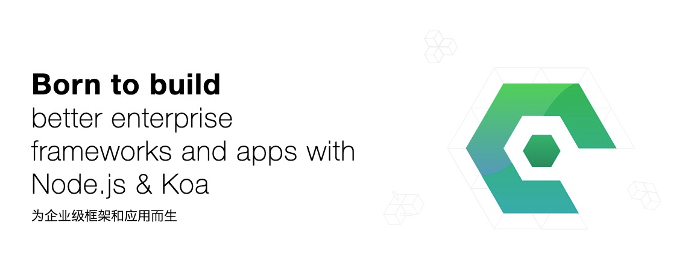

<div style="text-align:center">
	
</div>

[![NPM version][npm-image]][npm-url]
[![NPM quality][quality-image]][quality-url]
[![build status][travis-image]][travis-url]
[![Test coverage][codecov-image]][codecov-url]
[![David deps][david-image]][david-url]
[![Known Vulnerabilities][snyk-image]][snyk-url]
[![npm download][download-image]][download-url]
[![Open Collective backers and sponsors][opencollective-img]][opencollective-url]

[npm-image]: https://img.shields.io/npm/v/egg.svg?style=flat-square
[npm-url]: https://npmjs.org/package/egg
[quality-image]: http://npm.packagequality.com/shield/egg.svg?style=flat-square
[quality-url]: http://packagequality.com/#?package=egg
[travis-image]: https://img.shields.io/travis/eggjs/egg.svg?style=flat-square
[travis-url]: https://travis-ci.org/eggjs/egg
[codecov-image]: https://img.shields.io/codecov/c/github/eggjs/egg.svg?style=flat-square
[codecov-url]: https://codecov.io/gh/eggjs/egg
[david-image]: https://img.shields.io/david/eggjs/egg.svg?style=flat-square
[david-url]: https://david-dm.org/eggjs/egg
[snyk-image]: https://snyk.io/test/npm/egg/badge.svg?style=flat-square
[snyk-url]: https://snyk.io/test/npm/egg
[download-image]: https://img.shields.io/npm/dm/egg.svg?style=flat-square
[download-url]: https://npmjs.org/package/egg
[gitter-image]: https://img.shields.io/gitter/room/eggjs/egg.svg?style=flat-square
[gitter-url]: https://gitter.im/eggjs/egg
[opencollective-img]:https://img.shields.io/opencollective/all/eggjs?style=flat-square
[opencollective-url]:https://opencollective.com/eggjs

## Features

- Built-in Process Management
- Plugin System
- Framework Customization
- Lots of [plugins](https://github.com/search?q=topic%3Aegg-plugin&type=Repositories)

## Quickstart

Follow the commands listed below.

```bash
$ mkdir showcase && cd showcase
$ npm init egg --type=simple
$ npm install
$ npm run dev
$ open http://localhost:7001
```

> Node.js >= 8.0.0 required.

## Documentations

- [Documentations](https://eggjs.org/en/index.html)
- [Plugins](https://github.com/search?q=topic%3Aegg-plugin&type=Repositories)
- [Frameworks](https://github.com/search?q=topic%3Aegg-framework&type=Repositories)
- [Examples](https://github.com/eggjs/examples)

## Contributors

[](https://github.com/eggjs/egg/graphs/contributors)

## How to Contribute

Please let us know how can we help. Do check out [issues](https://github.com/eggjs/egg/issues) for bug reports or suggestions first.

To become a contributor, please follow our [contributing guide](CONTRIBUTING.md).

## Sponsors and Backers

[](https://opencollective.com/eggjs#support)
[](https://opencollective.com/eggjs#support)

## License

[MIT](LICENSE)
