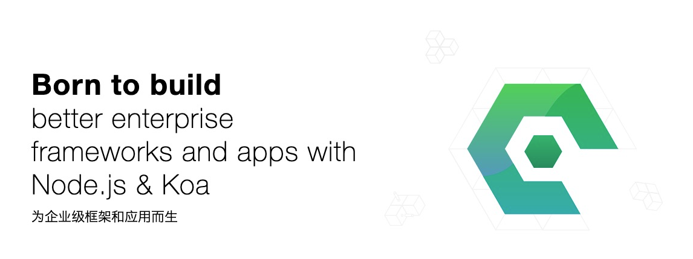

<div style="text-align:center">
	
</div>

[![NPM version][npm-image]][npm-url]
[![NPM quality][quality-image]][quality-url]
[![build status][travis-image]][travis-url]
[![Test coverage][codecov-image]][codecov-url]
[![David deps][david-image]][david-url]
[![Known Vulnerabilities][snyk-image]][snyk-url]
[![npm download][download-image]][download-url]
[![Open Collective backers and sponsors][opencollective-img]][opencollective-url]

[npm-image]: https://img.shields.io/npm/v/egg.svg?style=flat-square
[npm-url]: https://npmjs.org/package/egg
[quality-image]: http://npm.packagequality.com/shield/egg.svg?style=flat-square
[quality-url]: http://packagequality.com/#?package=egg
[travis-image]: https://img.shields.io/travis/eggjs/egg.svg?style=flat-square
[travis-url]: https://travis-ci.org/eggjs/egg
[codecov-image]: https://img.shields.io/codecov/c/github/eggjs/egg.svg?style=flat-square
[codecov-url]: https://codecov.io/gh/eggjs/egg
[david-image]: https://img.shields.io/david/eggjs/egg.svg?style=flat-square
[david-url]: https://david-dm.org/eggjs/egg
[snyk-image]: https://snyk.io/test/npm/egg/badge.svg?style=flat-square
[snyk-url]: https://snyk.io/test/npm/egg
[download-image]: https://img.shields.io/npm/dm/egg.svg?style=flat-square
[download-url]: https://npmjs.org/package/egg
[opencollective-img]:https://img.shields.io/opencollective/all/eggjs?style=flat-square
[opencollective-url]:https://opencollective.com/eggjs

## 特性

- 内置多进程管理
- 高度可扩展的插件机制
- 深度框架定制
- 丰富的[插件](https://github.com/search?q=topic%3Aegg-plugin&type=Repositories)

> 支持 Node.js 8.x 及以上版本。

## 快速开始

```bash
$ mkdir showcase && cd showcase
$ npm init egg --type=simple
$ npm install
$ npm run dev
$ open http://localhost:7001
```

## 文档

- [官方文档](https://eggjs.org/zh-cn/)
- [插件列表](https://github.com/search?q=topic%3Aegg-plugin&type=Repositories)
- [框架列表](https://github.com/search?q=topic%3Aegg-framework&type=Repositories)
- [官方示例](https://github.com/eggjs/examples)

## 贡献者

[](https://github.com/eggjs/egg/graphs/contributors)

## 贡献代码

请告知我们可以为你做些什么，不过在此之前，请检查一下是否有[已经存在的Bug或者意见](https://github.com/eggjs/egg/issues)。

如果你是一个代码贡献者，请参考[代码贡献规范](CONTRIBUTING.md)。

## 项目赞助

[](https://opencollective.com/eggjs#support)
[](https://opencollective.com/eggjs#support)

## 开源协议

[MIT](LICENSE)
